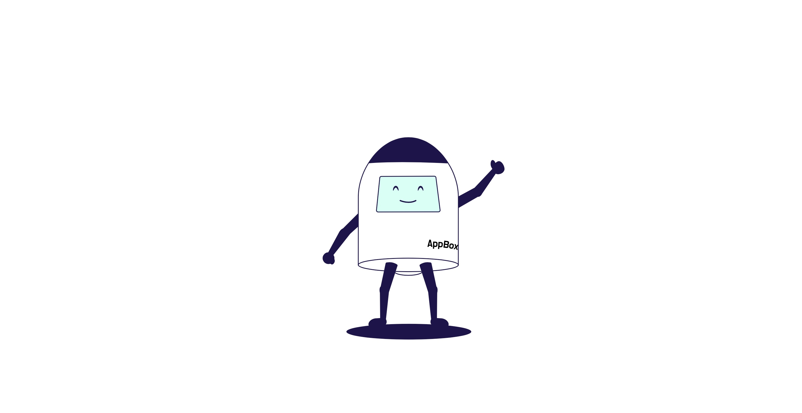

# AppBox SDK 사용 샘플소스

[](https://www.appboxapp.com)
[](https://android-arsenal.com/api?level=26)

- AppBox SDK는 모바일 웹사이트를 앱으로 패키징하여 최소한의 개발로 구글 플레이 및 앱스토어에 등록할 수 있는 솔루션입니다.
- 앱박스는 모바일 웹사이트에서 자바스크립트 코드를 사용해서 앱의 기능을 사용할 수 있게 하는 솔루션으로 40여가지 기능을 무료로 사용가능합니다.
- SDK 형태로 제공되어 도메인만 입력하면 기본 브라우져 기능부터 간편히 사용 가능합니다.

---

## 이 저장소가 보여주는 것

AppBox SDK를 Android 앱에 연결하는 **최소 구성 샘플**입니다. Kotlin과 Java 두 가지 형태로
같은 내용을 제공합니다.

| 파일 | 내용 |
| --- | --- |
| `MainApplicationKotlin.kt` / `MainApplicationJava.java` | SDK 초기화와 초기화 결과 확인 |
| `MainActivityKotlin.kt` / `MainActivityJava.java` | 로딩 화면·시스템 바·당겨서 새로고침 설정과 AppBox 화면 실행 |

시연하는 기능은 다음과 같습니다.

- `AppBox.initialize` — 프로젝트 ID와 웹 주소로 SDK 초기화
- 초기화 결과 확인 — `core`, `webView`, `push` 상태를 각각 확인
- `AppBox.setLoadingData` — 로딩 화면 설정
- `AppBox.setSystemBarAppearance` — 상태바·내비게이션 바 외관 설정
- `AppBox.setPullDownRefresh` — 당겨서 새로고침 사용 여부
- `AppBox.start` — AppBox 관리 화면 실행

Push, 네이티브 인앱 메시지, SNS 로그인, 걸음 수, AppsFlyer 등 나머지 기능의 사용법은
개발자 가이드를 참고하세요.

---

## 샘플 실행 방법

시작하기 전에 두 가지가 필요합니다.

| 필요한 것 | 얻는 곳 |
| --- | --- |
| 저장소 접근 정보 (`gpr.user`, `gpr.key`) | [AppBox 개발 가이드](https://www.appboxapp.com/guide/appbox) |
| 프로젝트 ID | AppBox 콘솔 |

### 1. 저장소 접근 정보 등록

AppBox SDK는 인증이 필요한 Maven 저장소에서 배포됩니다. 접근 정보는 아래 가이드에서
확인하세요.

> **[AppBox 개발 가이드에서 저장소 접근 정보 확인하기](https://www.appboxapp.com/guide/appbox)**

확인한 값을 프로젝트 루트의 `local.properties` 파일에 넣습니다.
이 파일은 저장소에 커밋하지 않습니다.

```
gpr.user={user}
gpr.key={key}
```

### 2. 프로젝트 ID와 웹 주소 변경

`MainApplicationKotlin.kt`에서 두 값을 실제 값으로 바꿉니다.

```kotlin
common = AppBoxCommonConfig(
    projectId = "PROJECT_ID",              // 콘솔에서 확인한 프로젝트 ID
    pushIcon = R.drawable.ic_launcher_background,
    debugMode = true
),
webView = AppBoxWebViewConfig(
    baseUrl = "https://www.example.com"    // 앱으로 패키징할 웹 주소
)
```

### 3. 실행

Android Studio에서 `app` 구성을 실행합니다.

### 4. Java 구성으로 전환하기

기본값은 Kotlin 구성입니다. Java 구성을 확인하려면
`app/src/main/AndroidManifest.xml`에서 `MainApplicationKotlin` / `MainActivityKotlin`
블록을 주석 처리하고 `MainApplicationJava` / `MainActivityJava` 블록의 주석을 해제합니다.

`MainApplicationJava.java`에도 프로젝트 ID와 웹 주소가 따로 들어 있습니다. 2단계에서
Kotlin 파일만 고쳤다면 Java 파일의 값도 같이 바꿔야 합니다.

### 5. 동작 확인

샘플은 초기화 결과를 `AppBoxKotlin`(Java 구성은 `AppBoxJava`) 태그로 출력합니다.
정상이면 아무것도 출력되지 않고, 문제가 있는 기능만 경고로 남습니다.

```
adb logcat -s AppBoxKotlin AppBoxJava
```

초기화 결과 확인은 로그보다 `AppBox.initialize` 의 반환값을 우선 사용하세요.

---

## SDK 연결 방법

### 저장소 등록

`settings.gradle.kts`에 AppBox 저장소를 등록합니다. 이 샘플에는 이미 설정되어 있습니다.

`local.properties`는 Gradle이 자동으로 읽어주지 않으므로 직접 읽는 코드가 필요합니다.
아래 블록을 통째로 사용하세요.

```kotlin
// settings.gradle.kts

val localProperties = java.util.Properties()
val localPropertiesFile = File(rootDir, "local.properties")

if (localPropertiesFile.exists()) {
    localPropertiesFile.inputStream().use { localProperties.load(it) }
}

val gprUser: String = localProperties.getProperty("gpr.user") ?: ""
val gprKey: String = localProperties.getProperty("gpr.key") ?: ""

dependencyResolutionManagement {
    repositoriesMode.set(RepositoriesMode.FAIL_ON_PROJECT_REPOS)
    repositories {
        google()
        mavenCentral()

        // appbox-auth-kakao 를 사용할 때만 필요합니다.
        maven { url = uri("https://devrepo.kakao.com/nexus/content/groups/public/") }

        maven {
            url = uri("https://maven.pkg.github.com/MobilePartnersCo/AppBoxSDKPackage")
            credentials {
                username = gprUser
                password = gprKey
            }
        }
    }
}
```

`gpr.user`와 `gpr.key`에 넣을 값은
[AppBox 개발 가이드](https://www.appboxapp.com/guide/appbox)에서 확인하세요.

### 의존성 추가

BOM으로 버전을 맞추고 사용할 기능의 artifact만 추가합니다.
**`appbox-core`는 모든 구성에서 반드시 선언해야 합니다.**

```kotlin
dependencies {
    implementation(platform("com.appboxapp.sdk:appbox-bom:1.3.36"))

    implementation("com.appboxapp.sdk:appbox-core")      // 필수
    implementation("com.appboxapp.sdk:appbox-webview")   // AppBox 관리 화면
    implementation("com.appboxapp.sdk:appbox-push")      // 푸시 알림
}
```

| 사용할 기능 | 추가할 artifact |
| --- | --- |
| 공통 진입점 | `appbox-core` |
| AppBox 관리 화면, 고객 WebView 연결 | `appbox-webview` |
| 푸시 알림 | `appbox-push` |
| 네이티브 인앱 메시지 | `appbox-inapp` |
| 걸음 수 | `appbox-health` |
| AppsFlyer 딥링크 | `appbox-appsflyer` |
| SNS 로그인 | `appbox-auth-google`, `appbox-auth-apple`, `appbox-auth-naver`, `appbox-auth-kakao` |

BOM은 버전만 맞추고 artifact를 자동으로 추가하지 않습니다.

`appbox-push`를 추가하면 알림 권한과 SDK 구성 요소가 AndroidManifest에 자동 병합됩니다.
다만 Android 13 이상의 알림 **런타임 권한 요청**은 앱이 직접 해야 합니다. 방법은 개발자
가이드를 참고하세요.

### SDK 초기화

`Application.onCreate()`에서 한 번만 호출합니다. `Application` 클래스는
AndroidManifest의 `android:name`에 등록해야 합니다. 등록하지 않으면 빌드와 실행은
성공하지만 SDK가 동작하지 않습니다.

```kotlin
class MainApplicationKotlin : Application() {
    override fun onCreate() {
        super.onCreate()

        val result = AppBox.initialize(
            context = this,
            config = AppBoxInitConfig(
                // AppBox 화면이 앱의 주 화면일 때 APPBOX_WEBVIEW 를 씁니다.
                // 앱이 자체 화면을 쓰면 기본값 SERVICE_APP 을 그대로 두세요.
                // 이 값에 따라 푸시 클릭을 어디로 보낼지가 달라집니다.
                usageMode = AppBoxUsageMode.APPBOX_WEBVIEW,
                common = AppBoxCommonConfig(
                    projectId = "PROJECT_ID",
                    pushIcon = R.drawable.ic_launcher_background,
                    debugMode = true
                ),
                webView = AppBoxWebViewConfig(
                    baseUrl = "https://www.example.com"
                ),
                push = AppBoxPushConfig()
            )
        )

        if (result.core.status != AppBoxInitStatus.INITIALIZED) {
            Log.w("AppBoxKotlin", "core: " + (result.core.error?.message ?: result.core.message))
        }
        if (result.webView.status != AppBoxInitStatus.INITIALIZED) {
            Log.w("AppBoxKotlin", "webView: " + (result.webView.error?.message ?: result.webView.message))
        }
        if (result.push.status != AppBoxInitStatus.INITIALIZED) {
            Log.w("AppBoxKotlin", "push: " + (result.push.error?.message ?: result.push.message))
        }
    }
}
```

`AppBox.initialize`는 값을 즉시 반환하며 기능별 초기화 상태를 각각 담고 있습니다.
한 기능의 실패가 다른 기능을 막지 않으므로 사용할 기능을 각각 확인하세요.

| 상태 | 의미 |
| --- | --- |
| `INITIALIZED` | 기능 사용 준비 완료 |
| `SKIPPED` | 설정을 넣지 않았거나 artifact를 추가하지 않음 |
| `FAILED` | 설정값 또는 초기화 과정 오류 |

### AppBox 화면 실행

화면을 여는 Activity에서 호출합니다.

```kotlin
class MainActivityKotlin : AppCompatActivity() {
    override fun onCreate(savedInstanceState: Bundle?) {
        super.onCreate(savedInstanceState)
        setContentView(R.layout.activity_main)

        AppBox.setLoadingData(
            loadingIcon = null,
            sizePercentage = 10f,
            iconColor = null,
            backColor = null
        )

        AppBox.setSystemBarAppearance(
            backgroundHex = "#FFFFFF",
            style = AppBoxSystemBarStyle.Dark
        )

        AppBox.setPullDownRefresh(
            used = true
        )

        AppBox.start { success, error ->
            if (success) {
                Log.d("AppBoxKotlin", "SDK 실행 성공")
            } else {
                Log.e("AppBoxKotlin", "SDK 실행 실패: ${error?.message}")
            }
        }
    }
}
```

`success`는 화면 실행 요청이 전달됐다는 의미이며 웹페이지 로딩 완료를 뜻하지 않습니다.

`setLoadingData`, `setSystemBarAppearance`, `setPullDownRefresh` 세 함수는 **AppBox가 띄우는
화면에만 적용됩니다.** 이 함수를 호출한 Activity 자신의 화면은 바뀌지 않습니다.

`setSystemBarAppearance`의 `style`은 **글자와 아이콘 기준**입니다. `Light`는 밝은(흰색)
글자, `Dark`는 어두운(검은색) 글자입니다. 잘못된 색상값을 전달하면 호출 전체가 무시됩니다.

Java 사용법은 `MainApplicationJava.java`와 `MainActivityJava.java`를 참고하세요.
설정은 각 클래스의 `Builder`로 구성하고, 콜백은 익명 클래스로 구현합니다.

---

## 개발자 가이드

전체 공개 함수, 기능별 연동 방법, 오류 코드는 개발자 가이드를 참고하세요.

- **가이드**: [https://www.appboxapp.com/guide/dev](https://www.appboxapp.com/guide/dev)

---

## 요구 사항

SDK가 요구하는 값입니다.

| 항목 | 값 |
| --- | --- |
| Android | 8.0 이상 (minSdk 26) |
| compileSdk | 36 |
| Java / Kotlin JVM target | 17 |
| AppBox SDK | 1.3.36 |

`appbox-core`가 JVM 17로 컴파일되어 있어 앱도 JVM target 17이어야 합니다.

아래는 이 샘플이 사용하는 빌드 환경입니다. 최소 버전으로 검증된 값은 아니며, 더 낮은
버전에서도 동작할 수 있습니다.

| 항목 | 값 |
| --- | --- |
| Gradle | 8.11.1 |
| Android Gradle Plugin | 8.9.3 |
| Kotlin | 2.0.21 |

---

## 주의 사항

### 1. 초기화

- `AppBox.initialize`는 `Application.onCreate()`에서 한 번만 호출합니다.
- `Application` 클래스를 AndroidManifest의 `android:name`에 등록해야 합니다.
- `Activity.onCreate()`에서 호출하지 마세요. 화면 회전 등으로 반복 호출됩니다.
- 초기화 전에 다른 함수를 호출하지 마세요. `setLoadingData`, `setSystemBarAppearance`,
  `setPullDownRefresh`처럼 **실패를 알리지 않고 조용히 무시되는** 함수가 있어 원인을
  찾기 어렵습니다.

### 2. AndroidManifest 설정

앱에서 선언할 항목은 다음과 같습니다. 권한과 SDK 구성 요소는 각 artifact가 자동으로
병합합니다.

```xml
<uses-permission android:name="android.permission.INTERNET" />

<application
    android:name=".MainApplicationKotlin"
    android:allowBackup="false"
    android:fullBackupContent="false">
</application>
```

`appbox-webview`가 `allowBackup`, `fullBackupContent`, `usesCleartextTraffic`을
선언하므로 앱의 값이 다르면 manifest 병합 충돌이 발생할 수 있습니다. 이 경우 해당
항목에만 `tools:replace`를 적용합니다.

### 3. Firebase 설정

`google-services.json`과 `google-services` plugin은 필요하지 않습니다. Firebase 설정은
SDK가 AppBox 서버에서 받아 초기화합니다.

### 4. ProGuard / R8

각 artifact가 consumer 규칙을 함께 배포하므로 앱에서 AppBox keep 규칙을 따로 선언할
필요는 없습니다.

다만 이 샘플은 `isMinifyEnabled = false` 구성이라 축소·난독화를 켠 빌드에서는 검증되지
않았습니다. R8을 사용하는 앱은 release 빌드로 한 번 확인하고, 문제가 있으면 개발자
가이드 또는 지원 연락처로 문의하세요.

---

## 브라우저의 기본기능

- 동영상 플레이어의 전체화면 지원
- KG이니시스, 토스페이먼트, 나이스페이먼츠 등의 PG결제 지원
- 파일 업/다운로드: WebView 내에서 파일 업로드 및 다운로드 지원
- window.open()으로 새창 열기 지원

---

## 라이선스

- 앱박스의 SDK의 사용은 영구적으로 무료입니다. 기업 또는 개인 상업적인 목적으로 사용 할 수 있습니다.

---

## 데모앱 다운로드

- GooglePlay : https://play.google.com/store/apps/details?id=kr.co.mobpa.appbox
- AppStore : https://apps.apple.com/kr/app/id6737824370

---

## 지원

문제가 발생하거나 추가 지원이 필요한 경우 아래로 연락하세요:

- **이메일**: [contact@mobpa.co.kr](mailto:contact@mobpa.co.kr)
- **홈페이지**: [https://www.appboxapp.com](https://www.appboxapp.com)

---
